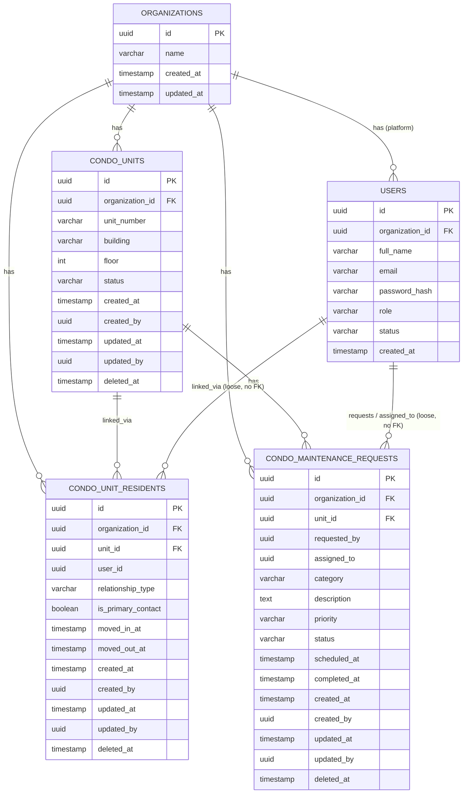

# Data Schema and ERD — Condominium Management Module

**Prefix:** `condo_` · All business tables use UUID primary keys generated in Python
(`uuid.uuid4()`), never database-generated and never client-supplied.

## Tables and Entities

| Table | Owner | Purpose |
|---|---|---|
| `organizations` | **ARGO platform** (stub only in my sandbox — not delivered) | Tenant anchor |
| `users` | **ARGO platform** (stub only in my sandbox — not delivered) | Authenticated actor with a role |
| `condo_units` | **This module** | A condo's physical unit inventory |
| `condo_unit_residents` | **This module** | Links a platform user to a unit as owner/tenant/co-resident |
| `condo_maintenance_requests` | **This module** | Core entity — a resident-submitted work order tied to a unit, with its own lifecycle |

**Why `organizations`/`users` are not part of the deliverable:** per the ARGO onboarding
contract, these already exist in the platform. My local sandbox creates a throwaway stub of
both (one fake org row, one fake user row) purely so my foreign keys resolve while developing
standalone. That stub migration is discarded at integration; the real Argo `organizations`
and `users` tables take over and my FKs line up automatically without any schema change on my
side.

**Why `condo_unit_residents` is kept separate from `condo_units`:** a unit's occupancy changes
over time (move-in/move-out) without deleting history, and a unit can have more than one
linked resident over its lifetime.

**Why `condo_maintenance_requests` is its own table, not a simple join:** it carries its own
lifecycle — status, assignment, and timestamps that change independently of the unit or
resident it references.

## Fields and Data Types

### `condo_units`

| Field | Type | Constraint / Purpose |
|---|---|---|
| `id` | UUID | PK, `default=uuid.uuid4`, generated in Python |
| `organization_id` | UUID | FK → `organizations.id`, `ON DELETE CASCADE`, `NOT NULL`, indexed |
| `unit_number` | VARCHAR(20) | NOT NULL |
| `building` | VARCHAR(50) | NULLABLE |
| `floor` | INT | NULLABLE |
| `status` | VARCHAR(20) | NOT NULL — `occupied` / `vacant` / `under_maintenance` |
| `created_at` | TIMESTAMP | NOT NULL, `default=utcnow` |
| `created_by` | UUID | NULLABLE, **no FK constraint** (loose reference to a user id) |
| `updated_at` | TIMESTAMP | NOT NULL, `default=utcnow`, `onupdate=utcnow` |
| `updated_by` | UUID | NULLABLE, **no FK constraint** |
| `deleted_at` | TIMESTAMP | NULLABLE — soft-delete marker |

### `condo_unit_residents`

| Field | Type | Constraint / Purpose |
|---|---|---|
| `id` | UUID | PK, `default=uuid.uuid4` |
| `organization_id` | UUID | FK → `organizations.id`, `ON DELETE CASCADE`, `NOT NULL`, indexed |
| `unit_id` | UUID | FK → `condo_units.id` (same-module FK — allowed), `NOT NULL` |
| `user_id` | UUID | **No FK constraint** — loose reference to a platform user id |
| `relationship_type` | ENUM | `owner` / `tenant` / `co_resident` |
| `is_primary_contact` | BOOLEAN | NOT NULL, default `false` |
| `moved_in_at` | TIMESTAMP | NOT NULL |
| `moved_out_at` | TIMESTAMP | NULLABLE |
| `created_at` | TIMESTAMP | NOT NULL, `default=utcnow` |
| `created_by` | UUID | NULLABLE, no FK |
| `updated_at` | TIMESTAMP | NOT NULL, `default=utcnow`, `onupdate=utcnow` |
| `updated_by` | UUID | NULLABLE, no FK |
| `deleted_at` | TIMESTAMP | NULLABLE — soft-delete marker |

### `condo_maintenance_requests`

| Field | Type | Constraint / Purpose |
|---|---|---|
| `id` | UUID | PK, `default=uuid.uuid4` |
| `organization_id` | UUID | FK → `organizations.id`, `ON DELETE CASCADE`, `NOT NULL`, indexed |
| `unit_id` | UUID | FK → `condo_units.id` (same-module FK — allowed), `NOT NULL` |
| `requested_by` | UUID | **No FK constraint** — loose reference to the resident/user id |
| `assigned_to` | UUID | NULLABLE, **no FK constraint** — loose reference to a staff user id |
| `category` | VARCHAR(30) | e.g. plumbing, electrical, hvac |
| `description` | TEXT | NOT NULL, 10–2000 chars (enforced in request schema) |
| `priority` | ENUM | `low` / `medium` / `high` / `urgent` |
| `status` | ENUM | `submitted` / `assigned` / `in_progress` / `completed` / `cancelled` / `rejected` — rejected at the DB level, not just the app level |
| `scheduled_at` | TIMESTAMP | NULLABLE — set on assignment |
| `completed_at` | TIMESTAMP | NULLABLE — set on completion |
| `created_at` | TIMESTAMP | NOT NULL, `default=utcnow` |
| `created_by` | UUID | NULLABLE, no FK |
| `updated_at` | TIMESTAMP | NOT NULL, `default=utcnow`, `onupdate=utcnow` |
| `updated_by` | UUID | NULLABLE, no FK |
| `deleted_at` | TIMESTAMP | NULLABLE — soft-delete marker |

## Primary and Foreign Keys

| Table | Primary Key | Foreign Keys |
|---|---|---|
| `organizations` *(platform stub)* | `id` | — |
| `users` *(platform stub)* | `id` | `organization_id` → `organizations.id` |
| `condo_units` | `id` | `organization_id` → `organizations.id` (CASCADE) |
| `condo_unit_residents` | `id` | `organization_id` → `organizations.id` (CASCADE); `unit_id` → `condo_units.id` |
| `condo_maintenance_requests` | `id` | `organization_id` → `organizations.id` (CASCADE); `unit_id` → `condo_units.id` |

> A foreign key alone only proves the referenced row exists — it does not prove it belongs to
> the same organization, so the API layer re-checks tenant ownership independently on every
> request (see `THREAT_MODEL.md`, Cross-Tenant Access).

**No FK to `users` anywhere** — `created_by`, `updated_by`, `requested_by`, and `assigned_to`
are all loose UUID columns per the platform contract (users get deactivated/reassigned and
must never block a delete). **No FK to any other intern's module tables.**

## UUID Identifiers

Every `id` and every foreign-key column is a UUIDv4. IDs are generated **in Python**
(`uuid.uuid4()`, via SQLAlchemy `default=uuid.uuid4`), immediately before an INSERT — not by
the database, and never accepted from the client.

## Relationships

- One organization has many `condo_units`.
- One `condo_unit` can have many linked residents over time (`condo_unit_residents`, with
  move-in/move-out history) and many `condo_maintenance_requests`.
- One `condo_maintenance_request` belongs to exactly one unit and, once assigned, references
  one staff user (loosely, by id).

## Important Indexes

| Index | Table | Purpose |
|---|---|---|
| `idx_condo_maintenance_org_status` | `condo_maintenance_requests` | List views filter by org + status together |
| `idx_condo_maintenance_org_unit` | `condo_maintenance_requests` | Looking up a specific unit's request history |
| `idx_condo_maintenance_org_assignee` | `condo_maintenance_requests` | Staff viewing their own assigned queue |
| `idx_condo_units_org` | `condo_units` | Every query filters by organization first |
| `idx_condo_unit_residents_org_user` | `condo_unit_residents` | Resolving "my unit" for a resident |

## Unique Constraints

| Constraint | Table | Why |
|---|---|---|
| `uq_condo_units_org_building_number` | `condo_units` | A unit number must be unique within its building and organization, not globally. `organization_id` leads the constraint per the platform contract. |
| `uq_condo_unit_residents_primary_contact` | `condo_unit_residents` | Only one active primary contact per unit at a time — partial index on `is_primary_contact = true AND moved_out_at IS NULL` |

## Status Fields

`condo_maintenance_requests.status` is constrained to
`ENUM('submitted','assigned','in_progress','completed','cancelled','rejected')` — invalid
values are rejected **at the database level**, not just the application level.

## Audit Fields

Every business table carries:

| Field | Purpose |
|---|---|
| `created_at` | Auto-set on insert |
| `created_by` | Stamped from the authenticated user's ID (JWT) — never client-supplied, **no FK constraint** |
| `updated_at` | Auto-updated on any mutation |
| `updated_by` | Re-stamped on every mutation (assign, status change, edit), **no FK constraint** |

## Soft-Deletion Strategy

Every business table has `deleted_at TIMESTAMP NULL`. No endpoint runs a hard `DELETE`; all
reads filter with `WHERE deleted_at IS NULL`. This preserves maintenance/resident history even
if a record is later removed from normal view.

## ERD (Mermaid)

Note: `USERS ||--o{ CONDO_UNIT_RESIDENTS` and the two `condo_maintenance_requests`
relationships are drawn for readability only — they are **not enforced foreign keys** in the
actual schema, per the platform's "no FK to users" rule. They resolve at the application layer
via the authenticated JWT's `sub` claim.
