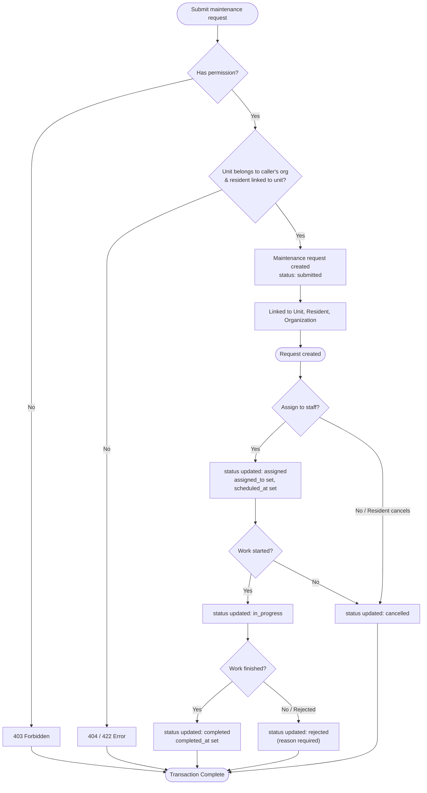

# Workflow and State Model — Maintenance Request Lifecycle

## Lifecycle of the Core Entity

```
(none) → Submitted (on creation)
Submitted → Assigned (maintenance.assign)
Submitted → Rejected (maintenance.update_status — reason required)
Submitted → Cancelled (maintenance.update_status, or Resident cancelling own)
Assigned → In Progress (maintenance.update_status)
Assigned → Cancelled (maintenance.update_status)
In Progress → Completed (maintenance.update_status)
Completed → * (blocked — terminal state)
Cancelled → * (blocked — terminal state)
Rejected → * (blocked — terminal state)
```

## Workflow Diagram



## State-Transition Table

| Current State | Allowed Next State | Required Permission | Guard Condition | Action Triggered |
|---|---|---|---|---|
| *(none)* | Submitted | `maintenance.create` | Referenced unit must belong to caller's org; Resident must be linked to the unit | `requested_by` / `created_by` stamped from JWT |
| Submitted | Assigned | `maintenance.assign` | `assigned_to` must be a valid staff user id in the same org | `scheduled_at` set; `updated_by` re-stamped |
| Submitted | Rejected | `maintenance.update_status` | A reason is required | `status` set to `rejected` |
| Submitted / Assigned | Cancelled | `maintenance.update_status` (or Resident, own request only) | None (staff); Resident: must be their own request, target must be `cancelled` | `status` set to `cancelled`; `updated_by` re-stamped |
| Assigned | In Progress | `maintenance.update_status` | Caller must be the assignee or hold `maintenance.assign` | `status` set to `in_progress` |
| In Progress | Completed | `maintenance.update_status` | Caller must be the assignee or hold `maintenance.assign` | `completed_at` set; `status` set to `completed` |
| Completed | *(none)* | — | Not allowed — completed is a terminal state | Request rejected with 409 Conflict; no fields changed |
| Cancelled | *(none)* | — | Not allowed — terminal state | 409 Conflict; no fields changed |
| Rejected | *(none)* | — | Not allowed — terminal state | 409 Conflict; no fields changed |

## Invalid Transitions Blocked

Attempting to change the status of a request that is already `Completed`, `Cancelled`, or
`Rejected` is rejected with **409 Conflict** — these are terminal states with no allowed next
state. The guard check runs before any field is written, so a rejected transition never
partially mutates the record.

## Resident-Specific Constraint

A Resident's only allowed transition is `Submitted`/`Assigned` → `Cancelled`, and only on a
request where `requested_by` matches their own JWT `sub`. This is checked in addition to (not
instead of) the general state-transition table — a Resident who sends any other target status
receives 403, regardless of the request's current state.
